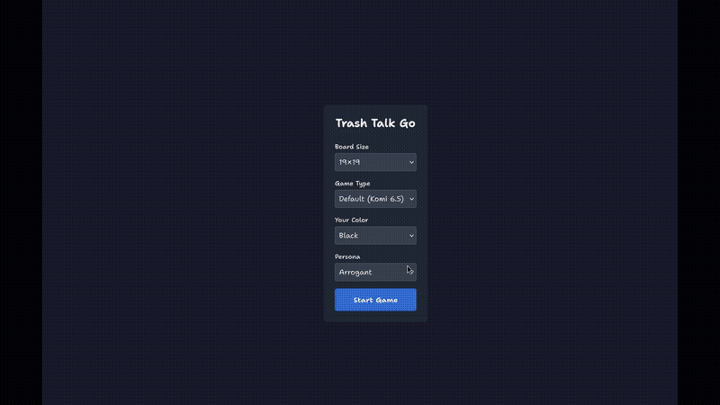

# KataGoLLuM (Trash-Talk Go Bot)

A Go-playing web application featuring an AI opponent with personality. Play Go against KataGo while trading banter with an LLM-powered persona!



## Features

- **Web-based Go board** - Click to play, visual stone placement
- **AI Personalities** - Choose from arrogant, sarcastic, encouraging, chill, or competitive personas
- **Handicap Games** - Play with 0-9 stone handicaps
- **Real-time Analysis** - Score evaluation for each move
- **Chat Interface** - Talk with the AI between moves

## Prerequisites

- Python 3.12+
- Node.js 18+ (for frontend)
- [KataGo](https://github.com/lightvector/KataGo) - Go AI engine
- [Ollama](https://ollama.com/) - Local LLM runner (or OpenAI/Anthropic API key)

### Installing Ollama

1. Visit [ollama.com](https://ollama.com/) and follow installation instructions
2. Pull a model: `ollama pull llama3.2`
3. Start server: `ollama serve`

### Installing KataGo

1. Download KataGo from [GitHub releases](https://github.com/lightvector/KataGo/releases)
2. Download a neural network model (e.g., from [katagotraining.org](https://katagotraining.org/))
3. Place the `katago` binary in your PATH

## Installation

```bash
# Clone repository
git clone https://github.com/dakling/katagollum
cd trash-talk-bot

# Create Python virtual environment
python -m venv .venv
source .venv/bin/activate

# Install Python dependencies
pip install -r requirements.txt

# Install frontend dependencies
cd web_frontend && npm install && cd ..

# Run database migrations
make migrate
```

## Configuration

Settings are managed via YAML configuration files:

1. **Copy the default config:**
   ```bash
   mkdir -p ~/.config
   cp config.yaml.default ~/.config/katagollum.yaml
   ```

2. **Edit `~/.config/katagollum.yaml`** with your paths:
   ```yaml
   katago:
     model: ~/Go/katago-networks/kata1-b28c512nbt-s9584861952-d4960414494.bin.gz
     config: ~/Go/katago-networks/minimal_fast.cfg

   llm:
     model: llama3.2
     base_url: http://localhost:11434/v1
   ```

3. **Create KataGo config directory:**
   ```bash
   mkdir -p ~/Go/katago-networks
   # Copy minimal_fast.cfg to your KataGo directory
   cp minimal_fast.cfg ~/Go/katago-networks/
   ```

### Using Remote LLMs

To use OpenAI, Anthropic, or other providers:

```yaml
llm:
  model: gpt-4
  base_url: https://api.openai.com/v1
  # Set OPENAI_API_KEY environment variable
```

## Running the Application

Start all services with Make:

```bash
make up
```

This starts:
- **Ollama** (if not running)
- **KataGo MCP Server** (port 3001)
- **Django Backend** (port 8000)
- **Next.js Frontend** (port 3000)

Then open http://localhost:3000 in your browser.

### Individual Services

```bash
make run-ollama    # Start Ollama server
make run-mcp       # Start KataGo MCP server
make run-backend   # Start Django backend only
make run-frontend  # Start frontend only
```

### Stopping Services

```bash
make down          # Stop all servers and clear cache
```

## Usage

1. Open http://localhost:3000
2. Configure game settings:
   - Board size (9x9, 13x13, 19x19)
   - Game type (Default, No Komi, or Handicap 2-9 stones)
   - Your color (Black or White)
   - AI Personality
3. Click "Start Game"
4. Click on the board to place stones
5. Chat with the AI in the chat panel

## Project Structure

```
trash-talk-bot/
├── config.yaml.default          # Default configuration template
├── minimal_fast.cfg             # Fast KataGo settings
├── Makefile                     # Build and run commands
├── src/                         # Python source
│   ├── katago_mcp/             # KataGo MCP server
│   ├── llm/                    # LLM client
│   └── config_loader.py        # Configuration management
├── web_backend/                # Django REST API
├── web_frontend/               # Next.js React app
└── prompts/                    # AI personality definitions
```

## Configuration Reference

### `~/.config/katagollum.yaml`

```yaml
katago:
  model: ~/Go/katago-networks/kata1-b28c512nbt-s9584861952-d4960414494.bin.gz
  config: ~/Go/katago-networks/minimal_fast.cfg

llm:
  model: llama3.2
  base_url: http://localhost:11434/v1

game:
  default_board_size: 19
  default_komi: 6.5
  default_persona: arrogant

mcp:
  port: 3001
  transport: sse
```

### `minimal_fast.cfg`

Ultra-fast KataGo settings for responsive gameplay:
- `maxVisits = 5` - Only 5 MCTS visits per move
- `maxTime = 0.05` - 50ms time limit
- `analysisMaxVisits = 3` - Fast position analysis

For stronger play, use a standard KataGo config.

## Personalities

Personalities are defined in `prompts/personas.yaml`. Each includes:
- **Style** - Tone and mannerisms (arrogant, sarcastic, etc.)
- **Game flow instructions** - How to respond to moves
- **Score interpretation** - How to comment on good/bad moves

To add a new personality, edit `prompts/personas.yaml` following the existing format.

## Troubleshooting

### "KataGo MCP is NOT running"

Check the config file paths:
```bash
cat ~/.config/katagollum.yaml
# Verify model and config files exist at those paths
```

### Database errors

Run migrations:
```bash
make migrate
```

### Cache issues

Clear Python cache:
```bash
make clear-cache
```

### Port conflicts

Check if ports 3000, 3001, or 8000 are in use:
```bash
lsof -ti:3000  # Frontend
lsof -ti:3001  # MCP Server
lsof -ti:8000  # Backend
```

## Development

### Backend Testing
```bash
make test-backend
```

### Frontend Build
```bash
make build-frontend
```

### Django Shell
```bash
make shell-backend
```

## Architecture

```
┌─────────────────┐     ┌─────────────────┐     ┌─────────────────┐
│   Web Frontend  │◄───►│  Django Backend │◄───►│   KataGo MCP    │
│   (Next.js)     │     │  (REST API)     │     │    Server       │
│                 │     │                 │     │                 │
│  - Go board UI  │     │  - Game state   │     │  - GTP wrapper  │
│  - Chat interface│    │  - LLM calls    │     │  - Analysis     │
└─────────────────┘     └────────┬────────┘     └─────────────────┘
                                 │
                                 ▼
                        ┌─────────────────┐
                        │  LLM (Ollama/   │
                        │  OpenAI/etc.)   │
                        │                 │
                        │  - Persona      │
                        │  - Trash talk   │
                        └─────────────────┘
```

## License

MIT License - See LICENSE file for details.
